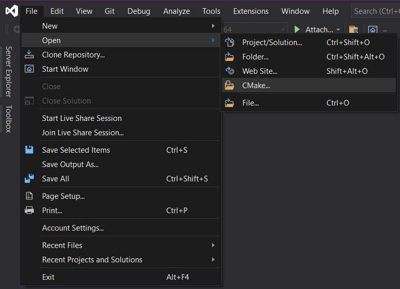

# life-of-boids in C++

See https://github.com/hpwxf/rs-life-of-boids for Rust version.

## Requirements

### CMake and C++ compiler

Check if CMake is installed and available in your PATH

```
cmake --version
```

It could be installed in `Program Files` directory, so that,

```
export PATH="C:/Program Files/CMake/bin":$PATH
```

will help to access to it.

You can install `cmake` in your local environment
using `pip install cmake --user`.

### Install conan

```
pip3 install conan
```

### Configure conan

* For GCC
  ```
  conan profile new default --detect
  conan profile update settings.compiler=gcc default
  conan profile update settings.compiler.version="${VERSION}" default
  conan profile update settings.compiler.libcxx=libstdc++11 default
  export CXX=g++${VERSION} 
  export CC=gcc${VERSION}
  ```
* For Clang
  ```
  conan profile new default --detect
  conan profile update settings.compiler=clang default
  conan profile update settings.compiler.version="${VERSION}" default
  conan profile update settings.compiler.libcxx=libstdc++11 default
  export CXX=clang++${VERSION} 
  export CC=clang${VERSION}
  ```
* For AppleClang
  ```
  conan profile new default --detect
  ```
* For MSVC
  ```
  conan profile new default --detect
  ```

⚠️ : by default `--detect` will set `build_type` to `Release`.
To define a `Debug` profile, you should use:

```
conan profile update settings.build_type=Debug <your-profile>
```

## Build and tests

Choose a build mode

```
MODE=Release
```

or

```
MODE=Debug
```

### Unix like (Linux ou macOS)

It will use `CC` and `CXX` environment variables defined before.

```
mkdir build
cd build
conan install ..
cmake \
    -DCMAKE_TOOLCHAIN_FILE=conan_paths.cmake \
    -DCMAKE_BUILD_TYPE="${MODE}" \
    ..
cmake --build .
ctest 
```

### Windows

```
mkdir build
cd build
conan install ..
cmake \
    -DCMAKE_TOOLCHAIN_FILE=conan_paths.cmake \
    -DCMAKE_GENERATOR_PLATFORM=x64 \
    ..
cmake --build . --config "${MODE}"
ctest -C "${MODE}"
```

### Using Visual Studio on Windows

* Configure conan for your project in directory

```
mkdir build2 # any name
cf build2
conan install ..
```

* Open CMake project
  

* Use conan configuration in CMake Settings


and check the CMake variables (bottom of the same page)


⚠️: you have to check a conan configuration consistent with the configuration type

If you need a debug configuration, first configure conan with debug mode (see above)

* Run!!!

When you compile and run the code, check you are using a compatible configuration type (don't mix Release profile with
Debug configuration).


## CMake options

* `-DENABLE_STATIC_ANALYSIS=ON|OFF` : enable/disable static analysis while compiling

* `-DCMAKE_CXX_COMPILER_LAUNCHER=ccache` : enable `ccache` as compiler cache

### Docker

Using image [conanio/gcc9](https://hub.docker.com/r/conanio/gcc9)

```
# install required system libs
sudo apt update && sudo apt install -y libgtk2.0-dev libgl1-mesa-dev
# install new profile with new ABI config
conan profile new default --detect
conan profile update settings.compiler.libcxx=libstdc++11 default
# standard build process
mkdir build && cd build
conan install ..
cmake -DCMAKE_TOOLCHAIN_FILE=conan_paths.cmake -DCMAKE_BUILD_TYPE=Debug ..
cmake --build .
ctest
```

or already ready-to-use image: [hpwxf/hpc-ai-2021](https://hub.docker.com/repository/docker/hpwxf/hpc-ai-2021)